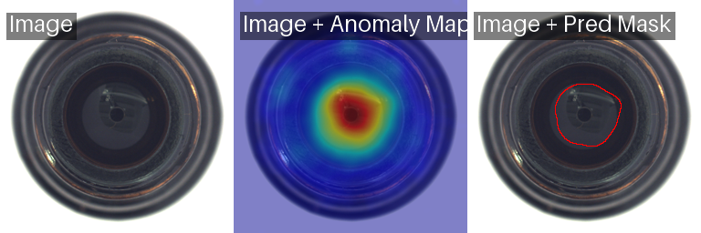

# 🔍 Anomaly Detection API

An image anomaly detection system built on **Anomalib**, served as a REST API with **FastAPI**. Supports two models: **PatchCore** and **CFA**.

---

## 📋 Table of Contents

- [Overview](#overview)
- [Requirements](#requirements)
- [Installation](#installation)
- [Project Structure](#project-structure)
- [Dataset Structure](#dataset-structure)
- [Usage Guide](#usage-guide)
- [API Reference](#api-reference)
- [Models](#models)

---

## 📌 Overview

This project provides an API to:
1. **Train** an anomaly detection model on your own dataset
2. **Run inference** — predict on new images and save overlay result images

Inference output includes the original image overlaid with an **anomaly map** to visually highlight anomalous regions.

---

## ⚙️ Requirements

- Python >= 3.9
- CUDA (recommended, not required)
- RAM >= 8GB

---

## 🛠 Installation

### 1. Clone the repository

```bash
git clone https://github.com/<your-username>/<repo-name>.git
cd <repo-name>
```

### 2. Create a virtual environment

```bash
python -m venv venv

# Windows
venv\Scripts\activate

# Linux / macOS
source venv/bin/activate
```

### 3. Install dependencies

```bash
pip install -r requirements.txt
```

### 4. Start the server

```bash
python app.py
```

Server runs at: `http://127.0.0.1:8002`

Swagger UI available at: `http://127.0.0.1:8002/docs`

---

## 📁 Project Structure

```
project/
│
├── app.py                  # FastAPI entrypoint
├── requirements.txt        # Python dependencies
├── README.md
│
├── src/                    # Source code
│   ├── __init__.py
│   ├── dataset.py          # Custom dataset class
│   ├── datamodule.py       # LightningDataModule
│   ├── train.py            # Training logic
│   └── test.py             # Inference logic
│
├── data/                   # Dataset (see structure below)
│   ├── train/
│   ├── val/
│   └── test/
│
├── model/                  # Model checkpoints saved here
│   └── best.ckpt           # (auto-generated after training)
│
├── overlay_results/        # Inference result images
└── results/                # Test metrics logs
```

---

## 🗂 Dataset Structure

The dataset **must** follow this directory structure:

```
data/
├── train/
│   └── normal/             ← Normal images for training ONLY
│       ├── img001.png
│       ├── img002.png
│       └── ...
│
├── val/
│   ├── normal/             ← Normal images for validation
│   │   ├── img001.png
│   │   └── ...
│   └── anomaly/            ← Anomalous images for validation
│       ├── img001.png
│       └── ...
│
└── test/
    ├── normal/             ← Normal images for testing
    │   ├── img001.png
    │   └── ...
    └── anomaly/            ← Anomalous images for testing
        ├── img001.png
        └── ...
```

> **Important notes:**
> - The `train/` folder contains **only normal images** (unsupervised anomaly detection).
> - The `val/` and `test/` folders contain **both** `normal` and `anomaly` subfolders.
> - Supported image formats: `.png`, `.jpg`, `.jpeg`, `.bmp`

---

## 🚀 Usage Guide

### Step 1 — Check server status

```bash
GET http://127.0.0.1:8002/status
```

Returns the server status, available device (CPU/GPU), and whether a model is trained or currently training.

---

### Step 2 — Set dataset path

```bash
POST http://127.0.0.1:8002/set_dataset_path?root=./data
```

| Parameter | Type   | Description                        |
|-----------|--------|------------------------------------|
| `root`    | string | Root path to the dataset directory |

---

### Step 3 — Train the model

```bash
POST http://127.0.0.1:8002/train
```

| Parameter          | Type    | Default      | Description                                  |
|--------------------|---------|--------------|----------------------------------------------|
| `category`         | string  | `my_data`    | Category name (does not affect data loading) |
| `type_model`       | string  | `Patchcore`  | Model type: `Patchcore` or `Cfa`             |
| `backbone`         | string  | `resnet18`   | Feature backbone (CFA only)                  |
| `lr`               | float   | `0.01`       | Learning rate (CFA only)                     |
| `train_batch_size` | int     | `2`          | Batch size during training                   |
| `eval_batch_size`  | int     | `2`          | Batch size during evaluation/testing         |
| `num_workers`      | int     | `2`          | Number of DataLoader workers                 |
| `w`                | int     | `256`        | Image resize width                           |
| `h`                | int     | `256`        | Image resize height                          |

After training, the checkpoint is saved to `./model/best.ckpt`.

---

### Step 4 — Run inference

```bash
POST http://127.0.0.1:8002/inference?testPath=./data/test
```

| Parameter  | Type   | Description                              |
|------------|--------|------------------------------------------|
| `testPath` | string | Path to the folder of images to predict  |

Overlay result images are saved to `./overlay_results/`.

---

## 📡 API Reference

| Method | Endpoint              | Description                        |
|--------|-----------------------|------------------------------------|
| GET    | `/status`             | Check server and model status      |
| POST   | `/set_dataset_path`   | Set the dataset root path          |
| POST   | `/train`              | Train the anomaly detection model  |
| POST   | `/inference`          | Run prediction on new images       |

Full Swagger UI: `http://127.0.0.1:8002/docs`

---

## 🤖 Models

### PatchCore (Recommended)

- **How it works:** Compares patch-level features of test images against a memory bank built from normal training images.
- **Strengths:** No fine-tuning needed, fast training, strong performance across many datasets.
- **Best for:** Limited training data and when you need quick, reliable results.

### CFA (Coupled-hypersphere-based Feature Adaptation)

- **How it works:** Learns feature embeddings in hypersphere space to separate normal from anomalous samples.
- **Strengths:** More flexible; allows fine-tuning of learning rate and backbone.
- **Best for:** When you want finer control over the training process.

---

## 📊 Metrics

After training, the system automatically evaluates on the test set with the following image-level metrics:

- **F1 Score**
- **Precision**
- **Recall**

---

## 📝 cURL Examples

```bash
# 1. Check status
curl -X GET http://127.0.0.1:8002/status

# 2. Set dataset path
curl -X POST "http://127.0.0.1:8002/set_dataset_path?root=./data"

# 3. Train with PatchCore
curl -X POST "http://127.0.0.1:8002/train?type_model=Patchcore&w=256&h=256&train_batch_size=4"

# 4. Run inference
curl -X POST "http://127.0.0.1:8002/inference?testPath=./data/test"
```

---

## 🔧 Notes

- The model checkpoint is **overwritten** on each training run (saved to `model/best.ckpt`).
- While training is in progress (`training: true`), the dataset path cannot be changed.
- Without a GPU, the model runs on CPU — significantly slower, especially for CFA.
